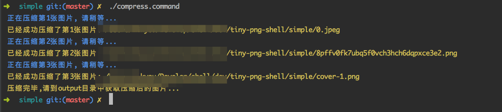

### 只需双击就能直接压缩mac中某个目录的所有图片的shell

#### 使用步骤:

* 1、只需把compress.command文件下载下来，然后修改文件的权限，给它加上可执行权限即可

```$xslt
chmod a+x compress.command
```

* 2、然后只需要把该文件拷贝到含有图片源文件的目录，双击该文件即可实现开始压缩


* 3、注意:记得替换TINY_API_KEY哦
